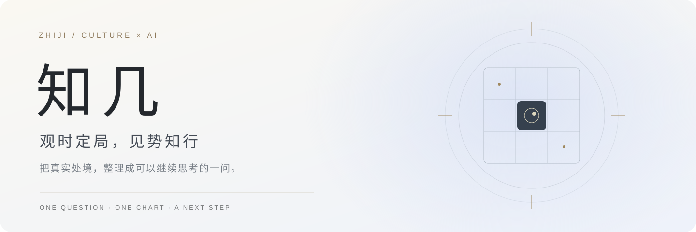
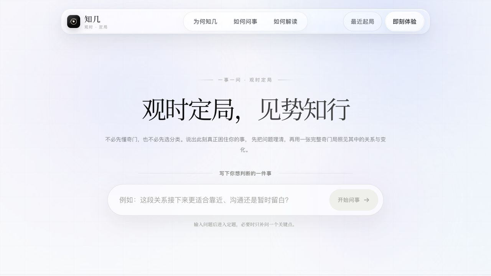
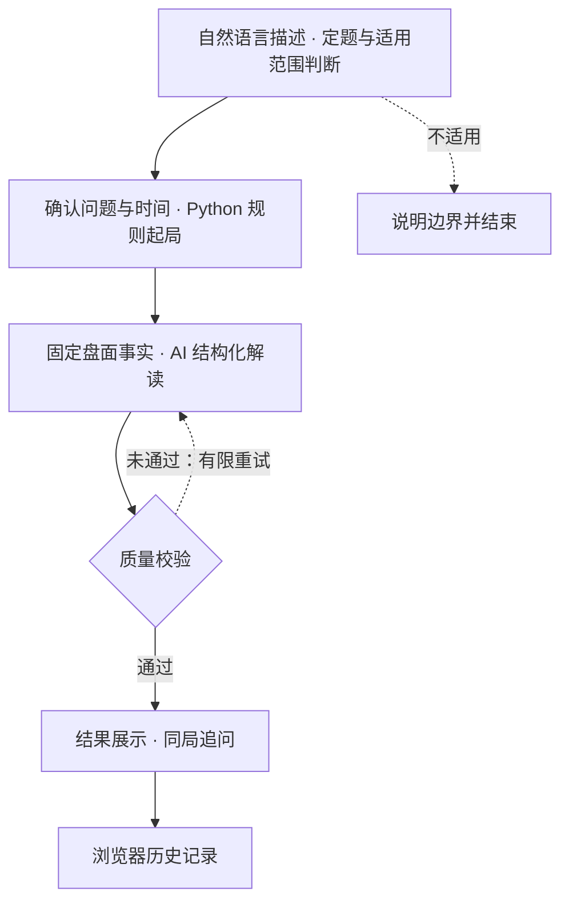

<div align="center">
  
  <br /><br />
  <strong>一事一问 · 规则起局 · AI 解读 · 同局追问</strong>
  <br /><br />
  <a href="https://si84sc05jtiar7dv0cumf.apigateway-cn-beijing.volceapi.com/">在线体验 ↗</a>
  &nbsp; · &nbsp;
  <a href="#为什么做知几">产品思考</a>
  &nbsp; · &nbsp;
  <a href="#技术实现">技术实现</a>
  &nbsp; · &nbsp;
  <a href="#本地运行">本地运行</a>
  <br /><br />
  
  
  
  
  
</div>

<br />

**知几**是一个探索传统文化与 AI 交互的 Web 产品。用户用自然语言描述处境，系统协助定题，通过固定规则生成奇门盘面，再结合用户背景给出白话解读与行动建议。

项目关注的核心问题是：**怎样让一次抽象的文化体验，变成有上下文、有依据、可以继续追问的交互？**

> 当前采用邀请码体验。奇门在这里作为传统文化象意与自我反思的载体，不具有科学预测能力；回答不能替代现实核验或专业判断。

## 看一眼知几

<a href="https://si84sc05jtiar7dv0cumf.apigateway-cn-beijing.volceapi.com/">
  
</a>

<p align="center"><sub>线上首页实拍 · 2026.09.11 · 浅色留白、中文衬线字体与九宫交互</sub></p>

## 为什么做知几

### 01 / 先理解问题，再生成答案

“我该继续还是转向？”往往缺少具体对象与现实条件。知几把**定题**作为正式交互的一部分，让用户从模糊的困惑走向可以讨论的一件事。

### 02 / 把规则计算与语言生成分开

时间、节令、四柱、局数和九宫由规则引擎处理，模型在给定盘面上进行解释。这样可以分别检查**盘面是否算对**、**答案是否贴合问题**，也能追溯解读引用的盘面依据。

### 03 / 把一次回答延伸成持续对话

用户可以围绕同一局继续问原因、阻力和下一步。交互目标是让新增信息进入讨论，逐步形成更具体的行动，而非只停在一句抽象判词。

## 一次问事如何完成

| 环节 | 用户在做什么 | 系统负责什么 |
| :--- | :--- | :--- |
| **定题** | 描述事情、目标与限制 | 识别主题，必要时补充问题，处理不适用场景 |
| **起局** | 确认问题与问事时间 | 调用固定规则，计算并展示九宫盘面 |
| **解读** | 查看结论、依据与行动 | 以结构化格式生成说明，并检查回答质量 |
| **追问** | 补充情况，询问原因或下一步 | 结合盘面与对话上下文继续回应 |
| **回看** | 打开最近起局 | 从当前浏览器读取已保存的记录 |

## 技术实现



| 层次 | 技术选择 | 在项目中的作用 |
| :--- | :--- | :--- |
| 页面与交互 | Next.js 16 · React 19 · TypeScript | 定题对话、起局演示、九宫交互、结果与追问 |
| 服务接口 | Next.js Route Handlers | 组织 AI、排盘、邀请码和管理接口 |
| 规则引擎 | Python · `lunar_python` · `tzdata` | 通过 `qimen_cli.py` 计算标准盘面 |
| 语言生成 | DeepSeek · JSON Schema | 按固定字段生成解读与追问回答 |
| 质量控制 | 规则校验 · 重试 · 场景回归 | 检查结构、主题偏移、重复与事实边界 |
| 访问与存储 | 签名 Cookie · 邀请码 · localStorage | 邀请体验、后台管理和浏览器记录 |
| 线上运行 | 火山引擎 veFaaS | 部署 Next.js 服务及 Python 排盘依赖 |

### 值得展开的工程设计

- **固定盘面作为模型输入**：模型负责解释，不能自行改写起局结果。规则、解释逻辑与提示词分别记录版本，便于定位变化来源。
- **把回答变成数据契约**：结论、概述、行动和追问提示使用明确字段，便于页面展示、质量检查与回归比较。
- **按追问意图组织响应**：区分解释原因、询问时机、要求简化、提出行动和补充新事实，避免每轮都重复整段首答。
- **用问题场景检查体验**：测试覆盖排盘、个性化解读、语义、对抗输入、连续对话与邀请码访问。脚本通过与真实模型回答可用，是两种不同的验收。

<details>
<summary><strong>展开源码导览</strong></summary>

```text
app/
├── page.tsx                 # 主要产品交互
├── admin/                   # 邀请码管理页面
└── api/
    ├── ai/                  # 定题、解读与追问
    ├── qimen/               # 服务端排盘接口
    ├── invite/              # 体验访问
    └── admin/               # 管理接口
lib/
├── ai.ts                    # 请求类型、意图与对话逻辑
├── qimen-skill-server.ts    # Node.js 与 Python 排盘衔接
├── interpret.ts            # 取用、盘面依据与解释逻辑
├── quality.ts              # 解读与追问质量检查
├── rule-registry.ts        # 规则和提示版本
└── invite-*.ts              # 邀请码、会话与访问控制
scripts/                     # 回归与真实服务检查脚本
vendor/qimen-dunjia/          # 排盘脚本与规则资料
```

</details>

## 版本与迭代

**公开仓库与线上产品目前不是同一发布快照。** 上面的技术导览对应本仓库已有实现；截图和下面的进展对应 2026.09.11 的线上产品。

| 状态 | 内容 |
| :--- | :--- |
| **本仓库已有** | 定题、规则排盘、AI 解读、同局追问、浏览器历史、邀请码管理与回归脚本 |
| **线上已迭代，尚未同步本仓库** | 同一件事复用原局与首答、澄清后的暂停出口、进展与反馈记录、历史删除、多轮事实审核改进 |
| **下一步** | 同步经过验收的代码与发布记录；减少重试和等待；扩展多轮评测与人工语义审阅 |
| **探索方向** | 有来源与版本标记的传统文化知识检索、规则出处说明、更清晰的反馈回访体验 |

知识检索仍是探索方向，当前不将 RAG、向量数据库、模型微调或多 Agent 协作写成已经落地的能力。

## 本地运行

准备 Node.js 22.18+、npm 和 Python 3.10+。以下步骤启动本地页面：

```bash
git clone https://github.com/HurmitLI/zhiji-qimen.git
cd zhiji-qimen
npm ci

python3 -m venv .qimen-venv
source .qimen-venv/bin/activate
python -m pip install -r vendor/qimen-dunjia/scripts/requirements.txt

npm run dev
```

打开 `http://localhost:3000`。**完整问答还需要自己的模型与邀请码配置**，启动页面并不代表 AI 服务已连通。

<details>
<summary><strong>环境配置与本地验收</strong></summary>

在未纳入版本控制的 `.env.local` 中配置：

| 变量 | 用途 |
| :--- | :--- |
| `DEEPSEEK_API_KEY` | 自己的模型服务凭据；当前代码通过 Responses 接口调用模型 |
| `QIMEN_PYTHON` | 可选，Python 解释器路径；未设置时使用 `python3` |
| `INVITE_HASH_SECRET` | 邀请码哈希密钥 |
| `INVITE_SESSION_SECRET` | 体验会话签名密钥 |
| `ADMIN_SESSION_SECRET` | 管理会话签名密钥 |
| `ADMIN_PASSWORD_SALT` | 管理密码的随机盐 |
| `ADMIN_PASSWORD_HASH` | 使用上述盐生成的 scrypt 密码哈希，64 字节结果的十六进制字符串 |
| `INVITE_STORE_PATH` | 开发默认使用 `.invite-data`；生产需配置持久化目录 |

各密钥使用独立随机值。配置管理密码后，从本地 `/admin` 创建邀请码，再在首页进入体验；不要将密码、密钥或真实邀请码提交到仓库。模型名称与端点见 [`app/api/ai/route.ts`](app/api/ai/route.ts)，须确认自己的服务支持该配置。

当前开发代码在没有模型密钥时会尝试预设的线上代理。独立运行请使用自己的模型配置，不要把原站服务当作可共享的开发后端。

```bash
# 规则与回答逻辑回归；这些命令不是线上模型通过率
npm run test:qimen
npm run test:quality
npm run test:semantic
npm run test:conversation

# 生产构建
npm run build
```

真实模型检查另见 [`scripts/verify-live-ai-contract.mjs`](scripts/verify-live-ai-contract.mjs)。运行前阅读其目标地址与凭据要求，使用构造问题验收，不把个人历史作为默认测试集。

</details>

---

<div align="center">
  <strong>观时 · 定局 · 见势 · 知行</strong><br />
  <sub>让文化体验有清晰的交互，让 AI 回答有可以核对的依据。</sub><br /><br />
  <a href="https://si84sc05jtiar7dv0cumf.apigateway-cn-beijing.volceapi.com/">体验知几</a>
  &nbsp; · &nbsp;
  <a href="https://github.com/HurmitLI/zhiji-qimen/issues">反馈问题</a>
</div>
